# Online Judge

> A full-stack online judge platform built with the MERN stack, Docker, and a dedicated code execution service.

## Features

* [x] Authentication and Authorization
* [x] Code Submission
* [x] Code Testing
* [x] Automated Code Evaluation
* [x] Docker-based Sandboxed Code Execution
* [x] Execution Time and Memory Usage
* [x] Detailed Verdicts

  * Time Limit Exceeded (TLE)
  * Memory Limit Exceeded (MLE)
  * Compilation Error (CE)
  * Runtime Error (RTE)
  * Wrong Answer (WA)
  * Accepted (AC)
* [x] Submission History
* [x] Problem Filtering by Tags
* [x] Problem Search
* [x] Statistics Dashboard
* [x] Problem Creation
* [x] Support for C, C++, Java, and Python
* [ ] Asynchronous Job Queue
* [ ] API Rate Limiting
* [ ] E-mail Verification
* [ ] Forgot Password
* [ ] Leaderboard

## Supported Languages

* C
* C++ 11/14/17 (GCC)
* Java 8
* Python 3

## Tech Stack

### Frontend

* React.js
* JavaScript

### Backend

* Node.js
* Express.js
* MongoDB
* JWT Authentication

### Code Execution

* Docker
* Isolated execution environment
* Resource and execution limits

## Architecture

The application consists of three main components:

```text
React Client
     |
     v
Express Backend
     |
     +------> MongoDB
     |
     v
Judge Service
     |
     v
Docker Container
     |
     v
Compile → Execute → Test Cases → Verdict
```

The judge service executes submitted programs inside Docker containers to isolate user code from the host system and evaluates the output against predefined test cases.

## Planned Improvements

### Asynchronous Job Queue

Move code execution to background workers so that API requests are not blocked while submissions are being judged.

```text
Client
  |
  v
Backend → Job Queue → Judge Worker → Docker → Result
```

### API Rate Limiting

Limit the frequency of API requests and code submissions to prevent abuse and protect the judging infrastructure from excessive load.

## Prerequisites

* Node.js
* Docker Desktop
* MongoDB

## Environment Variables

Configure the required environment variables in the backend and judge service configuration.

Example:

```env
PORT=5000
JWT_PRIVATE_KEY=<your_jwt_secret>
MONGODB_URI=<your_mongodb_connection_string>
BACK_SERVER_URL=<your_backend_url>
JUDGE_URL=<your_judge_service_url>
```

## Setup Locally

### 1. Clone the Repository

```bash
git clone https://github.com/meetpatel0963/Online-judge.git
cd Online-judge
```

### 2. Start MongoDB

Make sure MongoDB is running locally or provide a MongoDB connection string through the environment variables.

### 3. Start the Backend

```bash
cd server
npm install
npm start
```

### 4. Start the Judge Service

Make sure Docker Desktop is running.

```bash
cd judge
mkdir submissions
npm install
```

Build the Docker execution image:

```bash
cd docker
docker build -t online-judge .
cd ..
npm start
```

### 5. Start the Client

```bash
cd client
npm install
npm start
```

The application will be available at:

```text
http://localhost:3000
```

## Screenshots

### Sign In

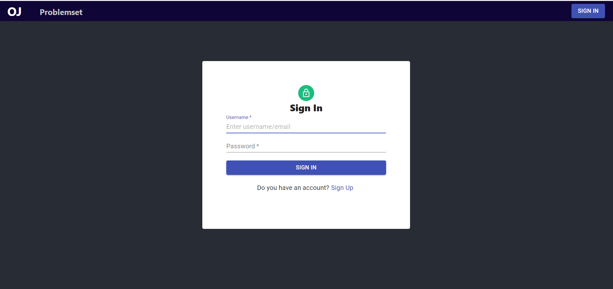

### Sign Up

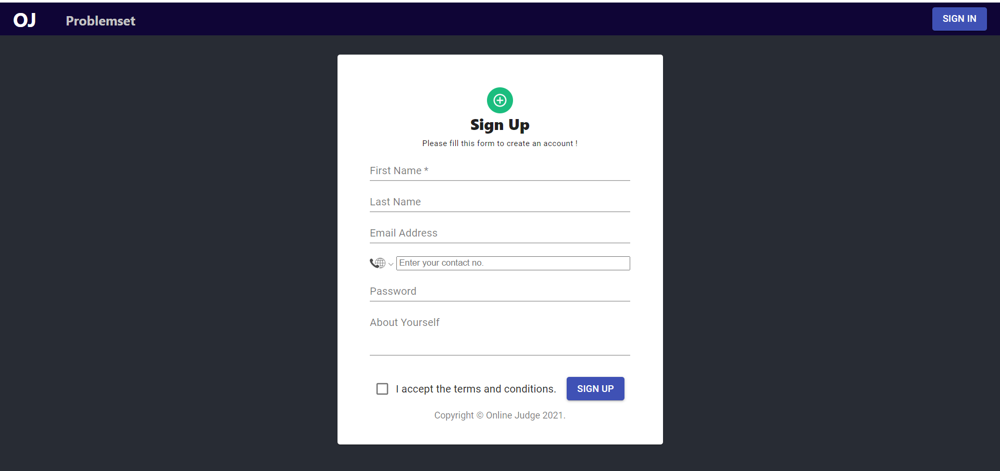

### Problem Set

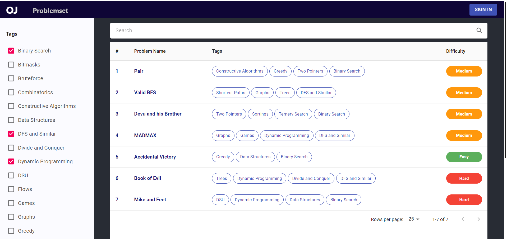

### Problem Page

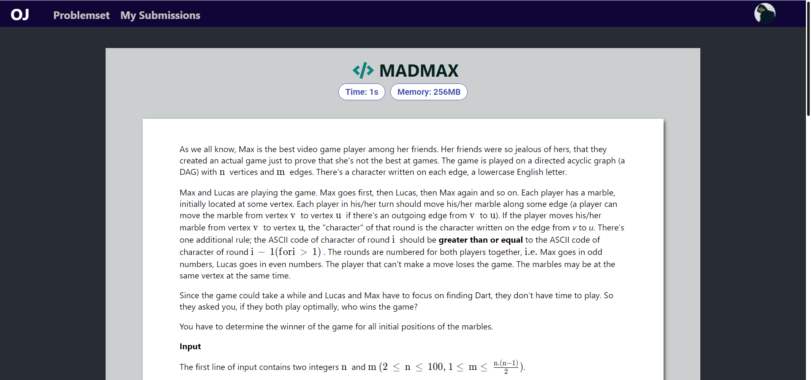

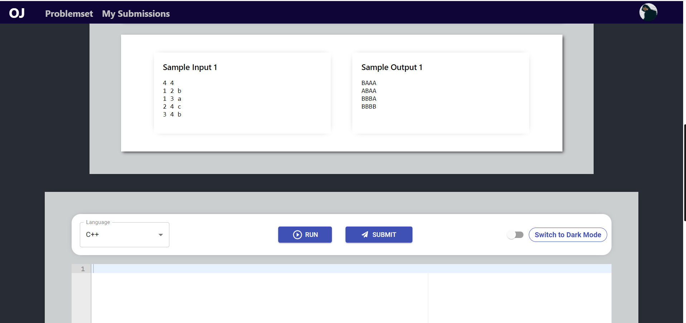

### Code Editor

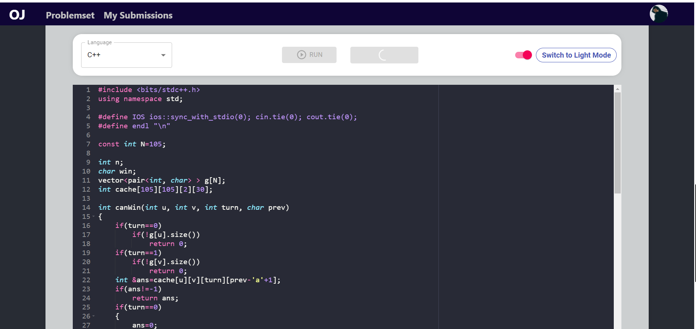

### Results

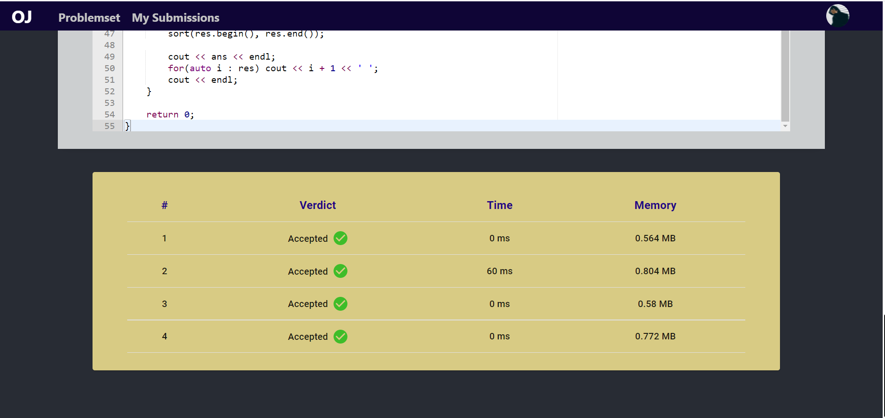

### Add Problem

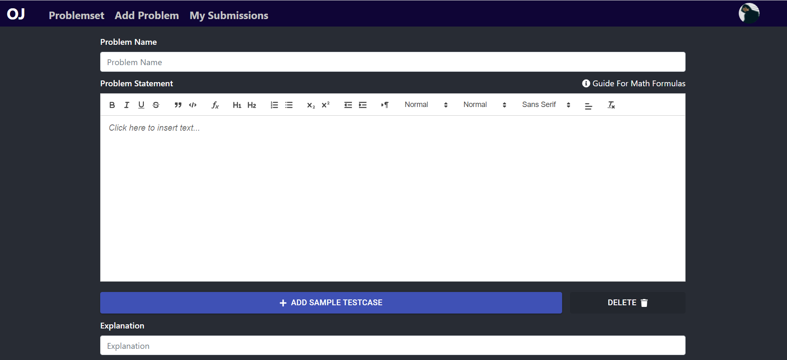

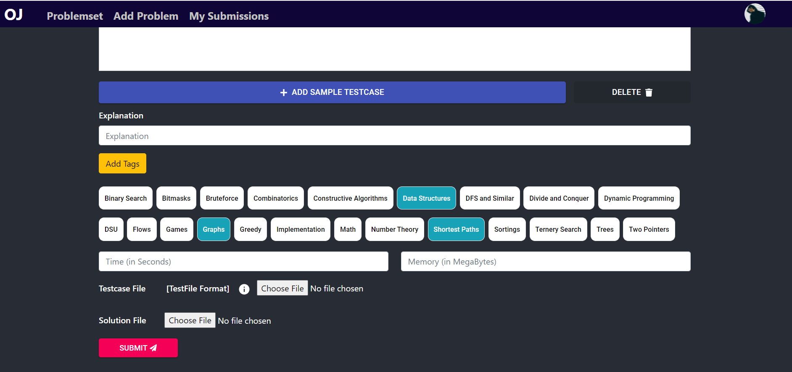

### User Submissions

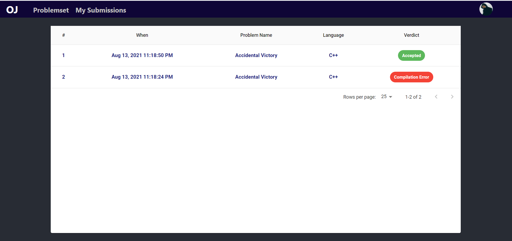

### Submission Details

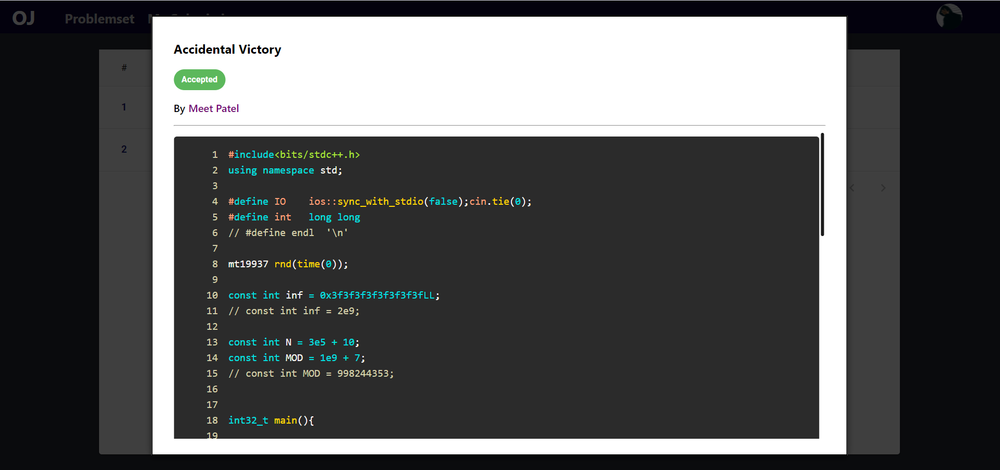

### Dashboard

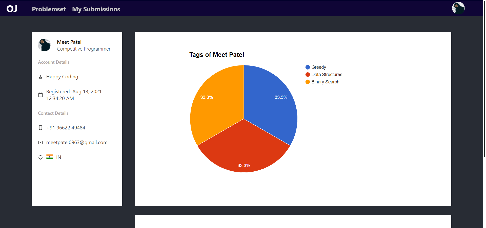

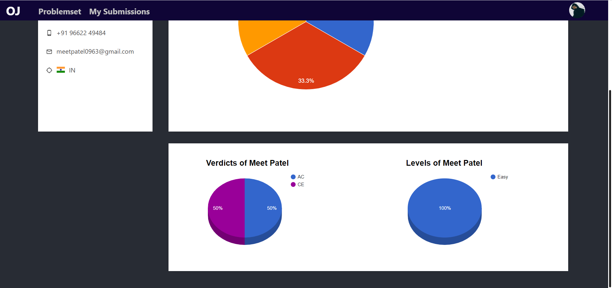

## Future Improvements

* Asynchronous job processing with a queue and worker architecture
* Multiple judge workers for horizontal scalability
* API rate limiting
* Real-time submission status updates
* Stronger Docker resource isolation
* Contest system and leaderboard
* Plagiarism detection

## License

This project is licensed under the [MIT License](http://opensource.org/licenses/MIT).
